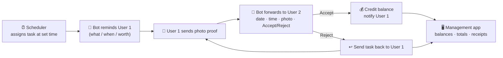
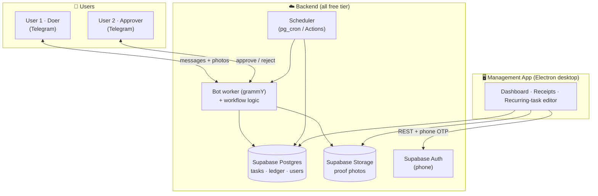
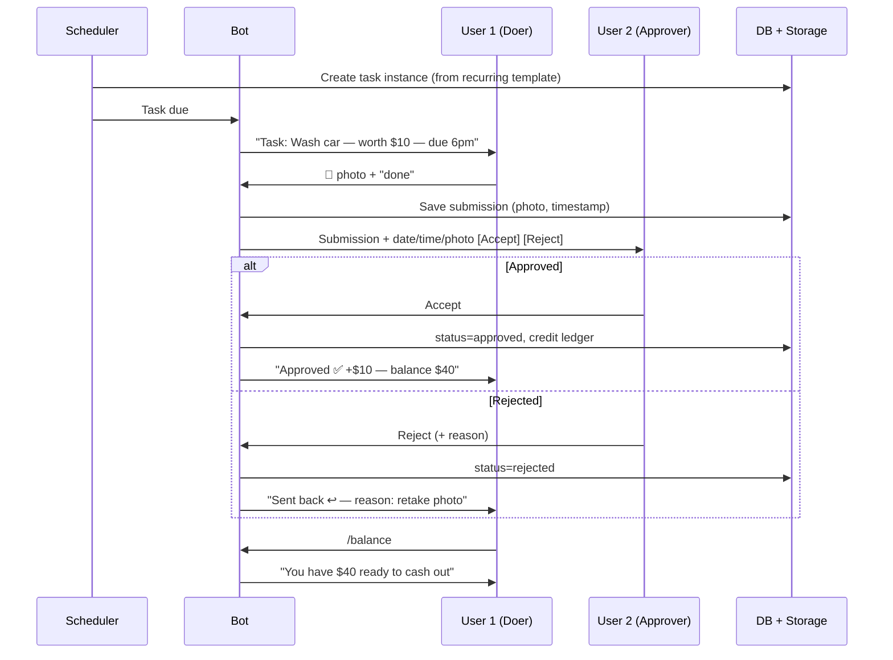

# TaskBounty

> Assign scheduled tasks → complete them and submit **photo proof** through a **free messaging bot** → an **approver** signs off → the doer accrues a **cash-out balance**. A **free management app** lets either person review every receipt.

**Status: 🚧 In build.** The **Telegram bot** is built and merged ([`apps/bot`](apps/bot)); the **Electron desktop app** is underway ([`apps/desktop`](apps/desktop)). This README holds the overall product design, architecture, and build plan. Start here, then dig into [`docs/`](docs/).

> 💸 **Design constraint: $0 to run and keep up.** Every piece below sits on a permanent free tier — no per-message fees, no metered services. (WhatsApp was considered but rejected: since July 2025 it bills **per message** for reminders/OTP, so it can't be the always-on channel. See [alternatives](docs/alternative-approaches.md).)

---

## The idea in one loop

1. At a **set time**, the system assigns a task to **User 1 — the Doer** — with a title, description, and how much it is worth.
2. The **bot reminds** User 1 what is due, when, and its value.
3. User 1 completes it and **sends a photo** as proof through the bot.
4. The bot forwards the submission — **date, time, and photo** — to **User 2 — the Approver** — with **Accept / Reject** buttons.
5. **Accept →** the task's value is **credited to User 1's balance**. **Reject →** the task is **sent back** to User 1 to redo.
6. User 1 can ask the bot for their **balance** at any time and later **cash out** (V1: just a number; real payouts are [V2](docs/payments-v2.md)).
7. Either person can open the **management app** to browse **every receipt** — metadata + photo — for at least the past month. User 2 can also **edit the recurring tasks and their payment amounts** there.



---

## Roles

| Role | Who | Does |
| --- | --- | --- |
| **Doer** (User 1) | Completes tasks | Gets reminders, submits photo proof, checks balance, requests cash-out. |
| **Approver / Admin** (User 2) | Verifies + pays | Approves/rejects submissions, and in the management app **edits recurring tasks and their payment amounts**. |

A single person can be a Doer for some tasks and an Approver for others — roles are assigned **per task**, not globally.

---

## Recommended technology stack (and why)

Everything below is **free to run indefinitely**, and it mirrors the Supabase stack already proven in the `Dashboard` project.

| Layer | Choice | Why this one |
| --- | --- | --- |
| **Messaging bot** | **Telegram Bot API** via [`grammY`](https://grammy.dev) (TypeScript) | **100% free, unlimited** — no per-message cost. **Native photo/media**, **inline Accept/Reject buttons**, push reminders, no business verification. The single best "free text bot" fit. |
| **Data + files + auth** | **Supabase** free tier | One service gives Postgres (data), Storage (photos), phone Auth, Realtime, and Row-Level Security. Auto-generated REST API for the desktop app. |
| **Scheduler** | Supabase **pg_cron** (or GitHub Actions cron, or `node-cron` in the worker) | Assigns tasks at set times and fires reminders. Free and durable. |
| **Bot host** | Small always-on Node worker on **Fly.io / Railway / Render** free tier (or a Supabase Edge Function webhook) | Runs the bot + workflow. Free allowances are plenty for two users. |
| **Management app** | **Electron** desktop app (React + Vite UI) | Free, cross-platform (Win/macOS/Linux), genuinely "downloadable software." Login by phone number. |
| **Phone login (free)** | **OTP delivered through the Telegram bot** | Enter phone → bot DMs a 6-digit code → you're in. No paid SMS gateway. |
| **Monorepo / language** | **Turborepo + pnpm + TypeScript** | One language across bot, backend, and app; shared types = fewer bugs. |
| **CI + distribution** | **GitHub Actions** → **GitHub Releases** | Free for public repos. Builds the Electron installers and publishes them as free downloads. |

Full rationale, data model, and the phone-login mechanics are in [`docs/architecture.md`](docs/architecture.md).

---

## High-level architecture



---

## Core workflow (message-level)



---

## Planned repository layout

```
TaskBounty/
├── apps/
│   ├── bot/            # Telegram bot worker (grammY) + workflow + scheduler
│   └── desktop/        # Electron management app (React + Vite UI)
├── packages/
│   ├── core/           # Domain logic: tasks, submissions, reviews, ledger
│   └── db/             # Supabase client, schema types, migrations
├── supabase/
│   ├── migrations/     # SQL schema + Row-Level Security policies
│   └── functions/      # (optional) Edge Functions
├── docs/               # Architecture, build plan, alternatives, payments
└── .github/workflows/  # CI + Electron release builds
```

---

## Build plan (phases)

| Phase | Focus | Outcome |
| --- | --- | --- |
| **0** | Repo + design (this) | README, architecture, build plan, alternatives, payment plan. |
| **1** | Foundations | Monorepo scaffold, Supabase project, schema + RLS, two seed users. |
| **2** | Domain + data | Core logic (create/submit/review/ledger), typed data layer. |
| **3** | Telegram bot | Commands, photo intake, Accept/Reject buttons, notifications, reject-return. |
| **4** | Scheduler | Recurring assignment from templates + due/overdue reminders. |
| **5** | Management app | Phone login, dashboard (totals + balance/owed), receipts (≥30 days) with photos, **recurring-task editor for User 2**. |
| **6** | Package + deploy | Electron installers via CI, bot deploy, Supabase prod config, backups. |
| **7** | Harden | Tests, RLS audit, rate limits, user guide. |

Detailed deliverables and acceptance criteria per phase: [`docs/build-plan.md`](docs/build-plan.md).

---

## Doing it differently — 3 alternatives

1. **Different channel:** WhatsApp (most familiar, but **bills per message** — not free to run) or SMS/MMS via Twilio (universal, but costs money and weak media) instead of Telegram.
2. **Different management surface:** a hosted **Progressive Web App** (nothing to download, works on phone + laptop) or a **native mobile app** instead of a desktop app.
3. **Different architecture:** a **no-code build** — Telegram + n8n/Make automation + **Airtable/Notion** as both database *and* the management UI (its gallery view is a ready-made receipts browser and editable task table).

Trade-offs and a recommendation: [`docs/alternative-approaches.md`](docs/alternative-approaches.md).

---

## Payments (saved for V2)

**V1 (now):** the balance is just a number in a ledger. A "cash-out" records an entry and decrements the number — **no real money moves.**

**V2 (later):** a payout layer on top of the same ledger (Stripe Connect / PayPal Payouts / Wise, or UPI-based Razorpay/Cashfree for India), with KYC, webhooks, idempotency, and reconciliation. Kept intentionally light for now: [`docs/payments-v2.md`](docs/payments-v2.md).

---

## Cost: designed to be $0

| Piece | Free tier |
| --- | --- |
| Telegram bot | **Free, unlimited** — no per-message cost. |
| Supabase (DB + Storage + Auth) | Free project (500 MB DB, 1 GB storage — ample for two users + a month of photos). |
| Bot hosting | Fly.io / Railway / Render free allowance. |
| Desktop app | Electron is open-source; distributed free via GitHub Releases. |
| CI | GitHub Actions free for public repos. |

---

## Open decisions (your call)

- **Messaging channel** — **Telegram (chosen — the free option)**. WhatsApp only if you later accept per-message billing for familiarity.
- **Desktop framework** — **Electron (chosen)**. Larger installers than Tauri, but a simpler toolchain.
- **License** — none chosen yet; MIT is a sensible default for a public repo.

---

## Docs

- [`docs/architecture.md`](docs/architecture.md) — components, data model, workflows, phone-login, security.
- [`docs/build-plan.md`](docs/build-plan.md) — phased plan with deliverables + acceptance criteria.
- [`docs/alternative-approaches.md`](docs/alternative-approaches.md) — 3 different ways to build this.
- [`docs/payments-v2.md`](docs/payments-v2.md) — the V2 payment design (kept light).
- [`docs/desktop-supabase-setup.md`](docs/desktop-supabase-setup.md) — run the desktop app on a free Supabase project.
