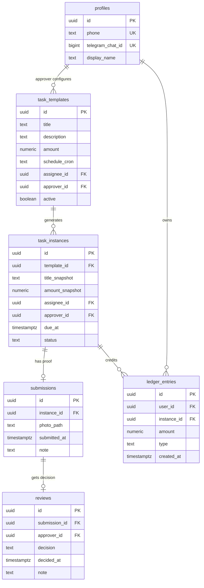

# Architecture

This document describes how Task-Bounty is designed to work. It is a design, not yet an implementation.

## 1. Components

| Component | Tech | Responsibility |
| --- | --- | --- |
| **Bot worker** | Node + TypeScript, [`grammY`](https://grammy.dev) | The messaging brain. Handles commands, photo uploads, Accept/Reject callbacks, and all outbound notifications. |
| **Scheduler** | Supabase `pg_cron` (or GitHub Actions cron / `node-cron`) | Creates task instances from recurring templates at set times; fires due and overdue reminders. |
| **Database** | Supabase Postgres | Source of truth: users, task templates, task instances, submissions, reviews, and the ledger. |
| **File storage** | Supabase Storage | Proof photos, referenced by path from submissions. |
| **Auth** | Supabase Auth + a Telegram-OTP bridge | Phone-number login for the management app. |
| **Management app** | Tauri (Rust shell) + React/Vite UI | Desktop app: dashboard, receipts history, and the recurring-task editor. |

Why Supabase: it collapses four otherwise-separate free services (database, object storage, auth, and an auto-generated API) into one, and it is the same backend already used in the `Dashboard` project — so there is no new operational learning curve.

## 2. Data model

### Why templates are separate from instances

- **`task_templates`** are the *recurring definitions* User 2 edits in the app: title, description, **amount**, schedule, who does it, who approves it. Editing one changes **future** tasks only.
- **`task_instances`** are the concrete occurrences the scheduler spawns. They **snapshot** the title and amount at creation time.

That snapshot is deliberate: if User 2 raises "Wash car" from $10 to $15 next week, last week's approved receipt must still read **$10**. Past receipts are immutable history; edits flow forward. This is exactly what makes "User 2 can edit recurring tasks and payment amounts" safe.

### Status values (`task_instances.status`)

`assigned → submitted → approved` (terminal) or `→ rejected → assigned` (loop back) or `→ expired` (missed, optional).

### The ledger

`ledger_entries` is an append-only list of money movements:

- **`type = 'earning'`**, positive `amount`, linked to the approved instance — written the moment User 2 accepts.
- **`type = 'cashout'`**, negative `amount` — written when User 1 cashes out (V1: just recorded; V2: a real payout settles it).

Balances are **derived**, never stored:

| Figure | Definition |
| --- | --- |
| **User 1 balance ("ready to receive")** | `sum(earnings) − sum(cashouts)` for that user. |
| **User 2 "amount owed"** | The mirror: the outstanding balance User 2 owes across their Doers. |
| **Total transacted** | Lifetime `sum(earnings)` (optionally + settled cash-outs). Shown to both. |

An append-only ledger means the books always reconcile and every number on the dashboard is explainable from raw entries — the right foundation for real payments in V2.

## 3. Workflows

### 3.1 Assignment + reminder
1. Scheduler wakes on each template's `schedule_cron`.
2. It inserts a `task_instance` (snapshotting title/amount) with `due_at` and `status = assigned`.
3. The bot messages User 1: **title, description, amount, due time.**
4. Follow-up reminders fire as due-time approaches and if overdue.

### 3.2 Submission
1. User 1 sends a **photo** (optionally with a note) to the bot.
2. The bot maps them to their open `assigned` instance, uploads the photo to Storage, and inserts a `submission` with `submitted_at`.
3. Instance → `status = submitted`.

### 3.3 Review
1. The bot sends User 2 the submission — **date, time, and photo** — with inline **Accept / Reject** buttons.
2. **Accept:** insert a `review` (`approved`), insert a `ledger_entry` (`earning`, `+amount_snapshot`), set instance `approved`, and tell User 1 their new balance.
3. **Reject:** insert a `review` (`rejected`, with reason), set instance back to `assigned`, and tell User 1 to redo it — the loop returns to 3.2.

### 3.4 Balance + cash-out
- `/balance` → bot replies with the derived balance.
- `/cashout` → bot records a cash-out intent; V1 inserts a `cashout` ledger entry and confirms the new (lower) number. **No real money moves in V1** — see [payments-v2](payments-v2.md).

## 4. The bot's command surface (draft)

| Command / action | Who | Effect |
| --- | --- | --- |
| `/start` | Both | Links the user's phone ↔ Telegram chat (shares contact once). |
| `/tasks` | Doer | Lists open tasks with value + due time. |
| `/balance` | Doer | Shows the amount ready to cash out. |
| `/cashout` | Doer | Records a cash-out (V1). |
| Send a **photo** | Doer | Submits proof for the current task. |
| **Accept / Reject** buttons | Approver | Approves or returns a submission. |
| Reminders (outbound) | Doer | "X is due at Y, worth Z." |

## 5. Phone-number login — free, via Telegram

The management app requires phone login and we want it to cost nothing:

1. User opens the app and enters their **phone number**.
2. Backend finds the `profile` whose `phone` matches and reads its linked `telegram_chat_id`.
3. Backend generates a 6-digit **OTP** and the **bot DMs it** to that chat.
4. User types the code into the app → backend verifies → issues a session token (a Supabase custom JWT or our own signed token).

This reuses the trust already established when the user ran `/start`, so there is **no paid SMS gateway**. (Supabase's built-in phone auth — real SMS OTP — is the drop-in alternative if you would rather not route login through Telegram; it needs a paid SMS provider.)

## 6. Management app screens

- **Dashboard** — total transacted, and, depending on who logged in, **balance "ready to receive"** (Doer) or **amount "owed"** (Approver).
- **History / Receipts** — every task for **≥ 30 days**: title, amount, assigned/submitted/decided timestamps, status, approver, and the **proof photo** (thumbnail → full).
- **Recurring tasks (Approver only)** — create/edit/disable `task_templates`: title, description, **amount**, schedule, assignee. Changes apply to future instances.

## 7. Security + privacy

- **Row-Level Security** on every table: a user reads only their own tasks/receipts/ledger; only a template's `approver_id` may edit it.
- **Storage policies** so proof photos are only readable by that task's Doer and Approver (signed URLs, not public).
- **Least-privilege keys:** the bot uses a service role on the server only; the app uses the anon key + RLS.
- **Secrets** (bot token, service key) live in host env vars, never in the repo. A committed `.env.example` documents the names only.
- **Immutable audit trail:** submissions, reviews, and ledger entries are append-only — the history cannot be quietly rewritten.

## 8. Deployment topology

| Piece | Where | Free? |
| --- | --- | --- |
| Postgres + Storage + Auth | Supabase project | Yes (free tier). |
| Bot worker + scheduler | Fly.io / Railway / Render (or Supabase Edge Function webhook) | Yes (free allowance). |
| Desktop app | Built in CI, shipped as GitHub Release installers | Yes (Actions free for public repos). |

Telegram delivers updates to the bot via **webhook** (preferred on a hosted worker) or long-polling (simplest for local dev).
