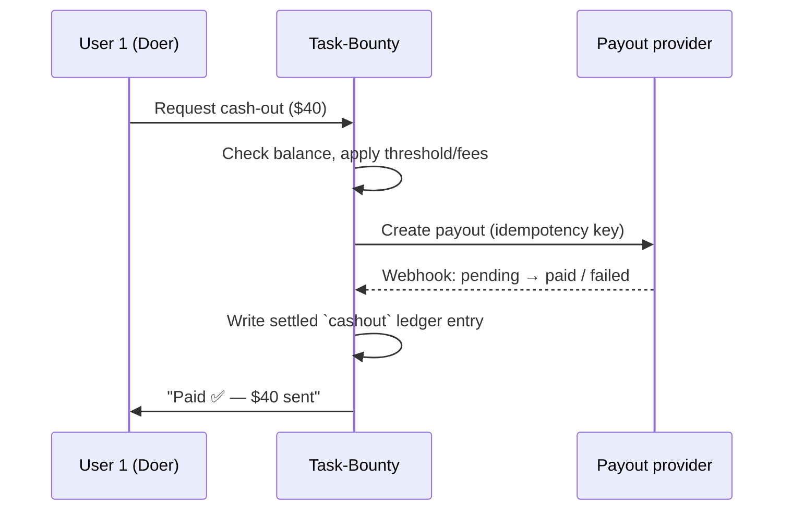

# Payments — V2 plan (kept intentionally light)

Payments are **out of scope for V1**. This is the sketch for later so V1 does not paint us into a corner.

## V1 recap — money is just a number

- Balances live in the append-only `ledger_entries` table (see [architecture](architecture.md#the-ledger)).
- Approving a task writes an `earning` entry; cashing out writes a `cashout` entry.
- **Nothing leaves any account.** The dashboard's "ready to receive" / "owed" are derived sums.

The one thing V1 must get right for V2's sake: **keep the ledger append-only and every number derived from it.** That is the whole foundation a payout system needs.

## V2 goal

Turn an approved balance into money that actually reaches User 1, without changing the loop the users already know.

## The cash-out flow (V2)

## Provider options (pick by region)

| Provider | Good for | Notes |
| --- | --- | --- |
| **Stripe Connect (Express)** | US/EU/global | Handles recipient onboarding + KYC for you; payouts to bank/debit. |
| **PayPal Payouts** | Wide reach, simple | Recipient needs a PayPal account. |
| **Wise** | Cross-border | Good FX rates for international pairs. |
| **Razorpay / RazorpayX / Cashfree Payouts** | **India (UPI / bank)** | Native UPI + IMPS payouts; the right choice if the users are in India. |

## Design principles

- **Ledger stays the source of truth.** A payout is a *settlement event* that references ledger entries — it never becomes the accounting itself.
- **Idempotency keys** on every payout call so a retry can't double-pay.
- **Webhook-driven status** (`pending → paid → failed`), with signature verification; the ledger only marks a cash-out settled when the webhook confirms it.
- **Never store raw bank details.** Vault/tokenize through the provider; keep only the provider's recipient ID.
- **KYC / AML** is the provider's job (Stripe Connect onboarding, etc.); the app just triggers and tracks it.
- **Guardrails:** minimum cash-out threshold, who absorbs fees, currency, and a clear record of every fee on the receipt.
- **Reconciliation + audit:** each payout maps back to ledger entries and stores the provider reference; the append-only history makes month-end reconciliation trivial.

## Deliberately *not* in V2's first cut

- Multi-currency FX optimization.
- Automated tax reporting / 1099s / TDS.
- Escrow or holding periods.

These can layer on once basic payouts are proven. The point of writing this now is only to make sure V1's ledger is shaped so none of it requires a rewrite.
